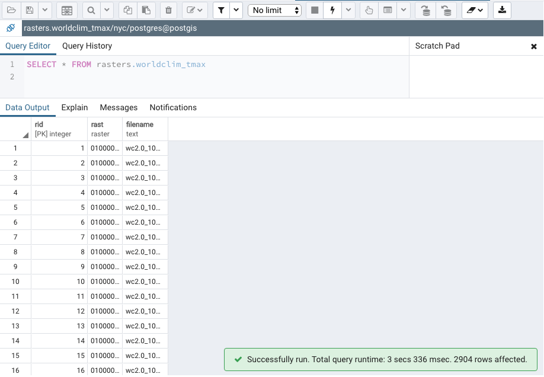
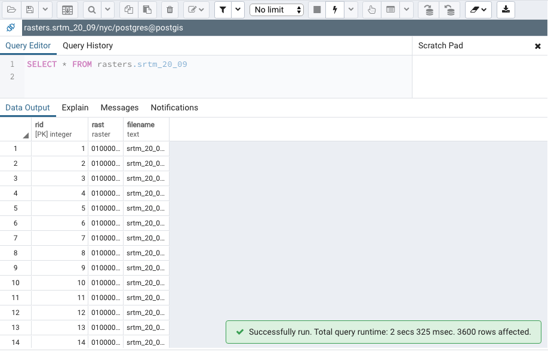

.. _working_with_rasters:

In this section you will learn to load a raster, get basic information on the raster, process and analyze it.

Before going further, we should describe what a raster is and what a raster is used for. At the simplest level, a raster is a photo or image with information describing where to place the raster on the Earth's surface. A photograph typically has three sets of values, one set for each primary color (red, green, and blue). A raster also has sets of values, often more than those found in a photograph. Each set of values is known as a band. So, a photograph typically has three bands while a raster has at least one band. As with digital photographs, rasters come in a variety of file formats. Common raster formats you may come across include PNG, JPEG, GeoTIFF, HDF5, and NetCDF. Since rasters can have many bands and even more values, they can be used to store large quantities of data in an efficient manner. Due to their efficiency, rasters are used for satellite and aerial sensors and modeled surfaces, such as weather forecasts.

Some definitions to consider:

* raster is the PostGIS data type for storing the raster files in PostgreSQL.
* Tile: This is a small chunk of the original raster file to be stored in one column of a table's row. Each tile has its own set of spatial information and thus is independent of all the other tiles in the same column of the same table, even if the other tiles are from the same original raster file.

For this section let's create a new schema where we will keep the objects for working with rasters. On your pgAdmin *query editor* write:

.. code-block:: sql

   CREATE SCHEMA rasters;
   
The data that we will use in this section is world climate data for the period of 1970-2000 by 10 min resolution provided by `worldclim <http://worldclim.org/version2>`_ but you can find it in the data folder **raster** of this tutorial.

1. First, let's inspect the ``wc2.0_10m_tmax_01.tif`` raster file using GDAL, you can install GDAL for unix/MAC using the binaries from `this site <https://sandbox.idre.ucla.edu/sandbox/general/how-to-install-and-run-gdal>`_ or using the `OSGeoW <https://trac.osgeo.org/osgeo4w/>`_ suite for Windows, which will provide all the packages you need. You can also open the raster with QGIS and inspect its metadata.

::

  Driver: GTiff/GeoTIFF
  Files: wc2.0_10m_tmax_01.tif
  Size is 2160, 1080
  Coordinate System is:
  GEOGCS["WGS 84",
      DATUM["WGS_1984",
          SPHEROID["WGS 84",6378137,298.257223563,
              AUTHORITY["EPSG","7030"]],
          AUTHORITY["EPSG","6326"]],
      PRIMEM["Greenwich",0],
      UNIT["degree",0.0174532925199433],
      AUTHORITY["EPSG","4326"]]
  Origin = (-180.000000000000000,90.000000000000000)
  Pixel Size = (0.166666666666667,-0.166666666666667)
  Metadata:
    AREA_OR_POINT=Area
  Image Structure Metadata:
    COMPRESSION=DEFLATE
    INTERLEAVE=BAND
  Corner Coordinates:
  Upper Left  (-180.0000000,  90.0000000) (180d 0' 0.00"W, 90d 0' 0.00"N)
  Lower Left  (-180.0000000, -90.0000000) (180d 0' 0.00"W, 90d 0' 0.00"S)
  Upper Right ( 180.0000000,  90.0000000) (180d 0' 0.00"E, 90d 0' 0.00"N)
  Lower Right ( 180.0000000, -90.0000000) (180d 0' 0.00"E, 90d 0' 0.00"S)
  Center      (   0.0000000,   0.0000000) (  0d 0' 0.01"E,  0d 0' 0.01"N)
  Band 1 Block=2160x1 Type=Float32, ColorInterp=Gray
    Min=-39.708 Max=42.235 
    Minimum=-39.708, Maximum=42.235, Mean=1.000, StdDev=1.000
    NoData Value=-3.39999999999999996e+38
    Metadata:
      STATISTICS_MAXIMUM=42.234750080109
      STATISTICS_MEAN=1.#SNAN
      STATISTICS_MINIMUM=-39.707750263214
      STATISTICS_STDDEV=1.#SNAN
      
2. From this information we know the coodinate system of the raster, the limits, pixel size, and some statistics on the values it contains.

3. For the next steps make sure you have postgreSQL binaries added to your path if not already added, for Mac this is done by:
 
::

   export PATH="/Applications/Postgres.app/Contents/Versions/11/bin:$PATH"

4. Now we're ready to load the rasters of maximum temperature into our database using ``raster2pgsql``.

::

   raster2pgsql -s 4326 -t 100x100 -F -I -C -Y wc2.0_10m_tmax_*.tif rasters.worldclim_tmax | psql -d nyc
   
5. Now let's load the rasters of minimum temperatur into our database using ``raster2pgsql``.

::

   raster2pgsql -s 4326 -t 100x100 -F -I -C -Y wc2.0_10m_tmin_*.tif rasters.worldclim_tmin | psql -d nyc

.. note::

   The raster2pgsql command is called with the following flags:
   -s: This flag assigns SRID 4326 to the imported rasters.
   -t: This flag denotes the tile size. It chunks the imported rasters into smaller and more manageable pieces; each record added to the table will be at most 100 x 100 pixels.
   -F: This flag adds a column to the table and fills it with the raster's filename.
   -I: This flag creates a GIST spatial index on the table's raster column.
   -C: This flag applies the standard set of constraints on the table. The standard set of constraints includes checks for dimension, scale, skew, upper-left coordinate, and SRID.
   -Y: This flag instructs raster2pgsql to use COPY statements instead of INSERT statements. COPY is typically faster than INSERT.

6. After running ths you'll have added the rasters to the rasters SCHEMA. The terminal output will be:

::

   Processing 1/12: wc2.0_10m_tmax_01.tif
   BEGIN
   CREATE TABLE
   COPY 11
   COPY 11
   COPY 11
   COPY 11
   COPY 11
   COPY 11
   COPY 11
   COPY 11
   COPY 11
   COPY 11
   COPY 11
   COPY 11
   COPY 11
   COPY 11
   COPY 11
   COPY 11
   COPY 11
   COPY 11
   COPY 11
   COPY 11
   COPY 11
   Processing 2/12: wc2.0_10m_tmax_02.tif
   COPY 11
   COPY 11
   COPY 11
   COPY 11
   COPY 11
   COPY 11
   COPY 11
   COPY 11
   COPY 11
   COPY 11
   COPY 11
   COPY 11
   COPY 11
   COPY 11
   COPY 11
   COPY 11
   COPY 11
   COPY 11
   COPY 11
   COPY 11
   COPY 11
   COPY 11
   Processing 3/12: wc2.0_10m_tmax_03.tif
   COPY 11
   COPY 11
   COPY 11
   COPY 11
   COPY 11
   COPY 11
   COPY 11
   COPY 11
   COPY 11
   COPY 11
   COPY 11
   COPY 11
   COPY 11
   COPY 11
   COPY 11
   COPY 11
   COPY 11
   COPY 11
   COPY 11
   COPY 11
   COPY 11
   COPY 11
   Processing 4/12: wc2.0_10m_tmax_04.tif
   COPY 11
   COPY 11
   COPY 11
   COPY 11
   COPY 11
   COPY 11
   COPY 11
   COPY 11
   COPY 11
   COPY 11
   COPY 11
   COPY 11
   COPY 11
   COPY 11
   COPY 11
   COPY 11
   COPY 11
   COPY 11
   COPY 11
   COPY 11
   COPY 11
   COPY 11
   Processing 5/12: wc2.0_10m_tmax_05.tif
   COPY 11
   COPY 11
   COPY 11
   COPY 11
   COPY 11
   COPY 11
   COPY 11
   COPY 11
   COPY 11
   COPY 11
   COPY 11
   COPY 11
   COPY 11
   COPY 11
   COPY 11
   COPY 11
   COPY 11
   COPY 11
   COPY 11
   COPY 11
   COPY 11
   COPY 11
   Processing 6/12: wc2.0_10m_tmax_06.tif
   COPY 11
   COPY 11
   COPY 11
   COPY 11
   COPY 11
   COPY 11
   COPY 11
   COPY 11
   COPY 11
   COPY 11
   COPY 11
   COPY 11
   COPY 11
   COPY 11
   COPY 11
   COPY 11
   COPY 11
   COPY 11
   COPY 11
   COPY 11
   COPY 11
   COPY 11
   Processing 7/12: wc2.0_10m_tmax_07.tif
   COPY 11
   COPY 11
   COPY 11
   COPY 11
   COPY 11
   COPY 11
   COPY 11
   COPY 11
   COPY 11
   COPY 11
   COPY 11
   COPY 11
   COPY 11
   COPY 11
   COPY 11
   COPY 11
   COPY 11
   COPY 11
   COPY 11
   COPY 11
   COPY 11
   COPY 11
   Processing 8/12: wc2.0_10m_tmax_08.tif
   COPY 11
   COPY 11
   COPY 11
   COPY 11
   COPY 11
   COPY 11
   COPY 11
   COPY 11
   COPY 11
   COPY 11
   COPY 11
   COPY 11
   COPY 11
   COPY 11
   COPY 11
   COPY 11
   COPY 11
   COPY 11
   COPY 11
   COPY 11
   COPY 11
   COPY 11
   Processing 9/12: wc2.0_10m_tmax_09.tif
   COPY 11
   COPY 11
   COPY 11
   COPY 11
   COPY 11
   COPY 11
   COPY 11
   COPY 11
   COPY 11
   COPY 11
   COPY 11
   COPY 11
   COPY 11
   COPY 11
   COPY 11
   COPY 11
   COPY 11
   COPY 11
   COPY 11
   COPY 11
   COPY 11
   COPY 11
   Processing 10/12: wc2.0_10m_tmax_10.tif
   COPY 11
   COPY 11
   COPY 11
   COPY 11
   COPY 11
   COPY 11
   COPY 11
   COPY 11
   COPY 11
   COPY 11
   COPY 11
   COPY 11
   COPY 11
   COPY 11
   COPY 11
   COPY 11
   COPY 11
   COPY 11
   COPY 11
   COPY 11
   COPY 11
   COPY 11
   Processing 11/12: wc2.0_10m_tmax_11.tif
   COPY 11
   COPY 11
   COPY 11
   COPY 11
   COPY 11
   COPY 11
   COPY 11
   COPY 11
   COPY 11
   COPY 11
   COPY 11
   COPY 11
   COPY 11
   COPY 11
   COPY 11
   COPY 11
   COPY 11
   COPY 11
   COPY 11
   COPY 11
   COPY 11
   COPY 11
   Processing 12/12: wc2.0_10m_tmax_12.tif
   COPY 11
   COPY 11
   COPY 11
   COPY 11
   COPY 11
   COPY 11
   COPY 11
   COPY 11
   COPY 11
   COPY 11
   COPY 11
   COPY 11
   COPY 11
   COPY 11
   COPY 11
   COPY 11
   COPY 11
   COPY 11
   COPY 11
   COPY 11
   COPY 11
   COPY 11
   COPY 11
   CREATE INDEX
   ANALYZE
   NOTICE:  Adding SRID constraint
   NOTICE:  Adding scale-X constraint
   NOTICE:  Adding scale-Y constraint
   NOTICE:  Adding blocksize-X constraint
   NOTICE:  Adding blocksize-Y constraint
   NOTICE:  Adding alignment constraint
   NOTICE:  Adding number of bands constraint
   NOTICE:  Adding pixel type constraint
   NOTICE:  Adding nodata value constraint
   NOTICE:  Adding out-of-database constraint
   NOTICE:  Adding maximum extent constraint
    addrasterconstraints 
   ----------------------
    t
   (1 row)
.. note::

   A similar output will be generated for the minimum temperature rasters.

7. You can now verify this on pgAdmin, the rasters have been loaded in the ``worldclim`` table under the rasters SCHEMA:

#. Nos let's import a SRTM layer for the area of New York taken from `http://srtm.csi.cgiar.org/ <http://srtm.csi.cgiar.org/>`_ but that is included in the data bundle.

::

   raster2pgsql -s 4326 -t 100x100 -F -I -C -Y srtm_20_09/srtm_20_09.tif rasters.srtm_20_09  | psql -d nyc
   
8. Verify that this is also reflected in pgAdmin:

9. Now let's obtain some information on the rasters within the database, for this, run the folloquin SQL command:

.. code-block:: sql

  SELECT
        r_table_name,
        r_raster_column,
        srid,
        scale_x,
        scale_y,
        blocksize_x,
        blocksize_y,
        same_alignment,
        regular_blocking,
        num_bands,
        pixel_types,
        nodata_values,
        out_db,
        ST_AsText(extent) AS extent
   FROM raster_columns WHERE r_table_name = 'worldclim_tmax';

Some of the results of this query are shown on the above table (because there are too many attributes):

::

     r_table_name  | r_raster_column | srid |   scale_x    |    scale_y    | blocksize_x | blocksize_y
   ----------------+-----------------+------+--------------+---------------+-------------+-------------
   worldclim_tmax  | rast            | 4326 | 0.1666666667 | -0.1666666667 | 100         | 100 

For this tutorial some insights were taken from the `PostGIS Cookbook 2nd Edition <https://www.amazon.com/PostGIS-Cookbook-organize-manipulate-analyze-ebook/dp/B075V94LS6/ref=dp_ob_image_def>`_, you're welcome to go further into it.
