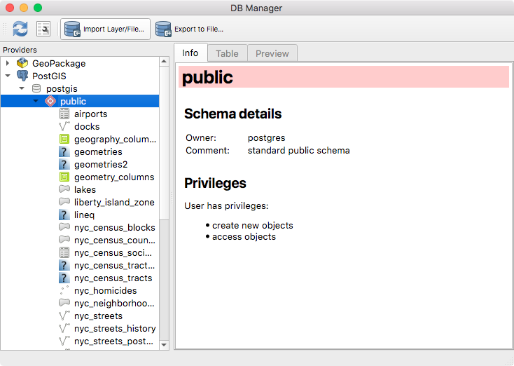
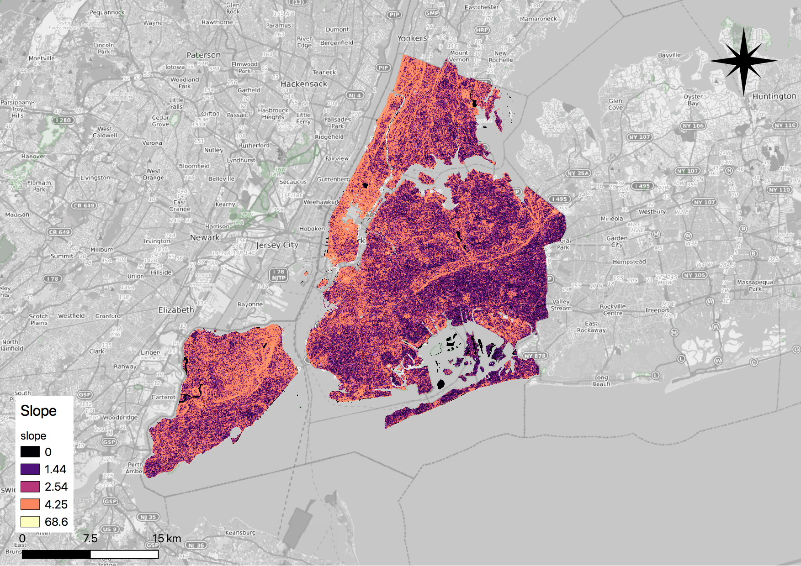

.. _rasters:

Working with Rasters
====================

In this section you will learn to load a raster, get basic information on the raster, process and analyze it.

Before going further, we should describe what a raster is and what a raster is used for. At the simplest level, a raster is a photo or image with information describing where to place the raster on the Earth's surface. A photograph typically has three sets of values, one set for each primary color (red, green, and blue). A raster also has sets of values, often more than those found in a photograph. Each set of values is known as a band. So, a photograph typically has three bands while a raster has at least one band. As with digital photographs, rasters come in a variety of file formats. Common raster formats you may come across include PNG, JPEG, GeoTIFF, HDF5, and NetCDF. Since rasters can have many bands and even more values, they can be used to store large quantities of data in an efficient manner. Due to their efficiency, rasters are used for satellite and aerial sensors and modeled surfaces, such as weather forecasts.

Some definitions to consider:

* Raster is the PostGIS data type for storing the raster files in PostgreSQL.
* Tile: This is a small chunk of the original raster file to be stored in one column of a table's row. Each tile has its own set of spatial information and thus is independent of all the other tiles in the same column of the same table, even if the other tiles are from the same original raster file.

For this section let's create a new ``SCHEMA`` where we will keep the objects for working with rasters. On your pgAdmin *query editor* write:

.. code-block:: sql

   CREATE SCHEMA rasters;
   
The data that we will use in this section is world climate data for the period of 1970-2000 by 10 min resolution provided by `worldclim <http://worldclim.org/version2>`_ but you can find it in the data folder **raster** of this tutorial, unzip it.

1. First, let's inspect the ``wc2.0_10m_tmax_01.tif`` raster file using GDAL, you can install GDAL for unix/MAC using the binaries from `this site <https://sandbox.idre.ucla.edu/sandbox/general/how-to-install-and-run-gdal>`_ or using the `OSGeoW <https://trac.osgeo.org/osgeo4w/>`_ suite for Windows, which will provide all the packages you need. You can also open the raster with QGIS and inspect its metadata.

::

  Driver: GTiff/GeoTIFF
  Files: wc2.0_10m_tmax_01.tif
  Size is 2160, 1080
  Coordinate System is:
  GEOGCS["WGS 84",
      DATUM["WGS_1984",
          SPHEROID["WGS 84",6378137,298.257223563,
              AUTHORITY["EPSG","7030"]],
          AUTHORITY["EPSG","6326"]],
      PRIMEM["Greenwich",0],
      UNIT["degree",0.0174532925199433],
      AUTHORITY["EPSG","4326"]]
  Origin = (-180.000000000000000,90.000000000000000)
  Pixel Size = (0.166666666666667,-0.166666666666667)
  Metadata:
    AREA_OR_POINT=Area
  Image Structure Metadata:
    COMPRESSION=DEFLATE
    INTERLEAVE=BAND
  Corner Coordinates:
  Upper Left  (-180.0000000,  90.0000000) (180d 0' 0.00"W, 90d 0' 0.00"N)
  Lower Left  (-180.0000000, -90.0000000) (180d 0' 0.00"W, 90d 0' 0.00"S)
  Upper Right ( 180.0000000,  90.0000000) (180d 0' 0.00"E, 90d 0' 0.00"N)
  Lower Right ( 180.0000000, -90.0000000) (180d 0' 0.00"E, 90d 0' 0.00"S)
  Center      (   0.0000000,   0.0000000) (  0d 0' 0.01"E,  0d 0' 0.01"N)
  Band 1 Block=2160x1 Type=Float32, ColorInterp=Gray
    Min=-39.708 Max=42.235 
    Minimum=-39.708, Maximum=42.235, Mean=1.000, StdDev=1.000
    NoData Value=-3.39999999999999996e+38
    Metadata:
      STATISTICS_MAXIMUM=42.234750080109
      STATISTICS_MEAN=1.#SNAN
      STATISTICS_MINIMUM=-39.707750263214
      STATISTICS_STDDEV=1.#SNAN
      
2. From this information we know the coodinate reference system of the raster, the limits, pixel size, and some statistics on the values it contains.

3. For the next steps make sure you have postgreSQL binaries added to your path if not already added, for Mac this is done by:
 
::

   export PATH="/Applications/Postgres.app/Contents/Versions/11/bin:$PATH"

4. Now we're ready to load the rasters of maximum temperature into our database using ``raster2pgsql``.

::

   raster2pgsql -s 4326 -t 100x100 -F -I -C -Y wc2.0_10m_tmax_*.tif rasters.worldclim_tmax | psql -d nyc
   
5. Now let's load the rasters of minimum temperature into our database using ``raster2pgsql``.

::

   raster2pgsql -s 4326 -t 100x100 -F -I -C -Y wc2.0_10m_tmin_*.tif rasters.worldclim_tmin | psql -d nyc

.. note::

   The raster2pgsql command is called with the following flags:
   -s: This flag assigns SRID 4326 to the imported rasters.
   -t: This flag denotes the tile size. It chunks the imported rasters into smaller and more manageable pieces; each record added to the table will be at most 100 x 100 pixels.
   -F: This flag adds a column to the table and fills it with the raster's filename.
   -I: This flag creates a GIST spatial index on the table's raster column.
   -C: This flag applies the standard set of constraints on the table. The standard set of constraints includes checks for dimension, scale, skew, upper-left coordinate, and SRID.
   -Y: This flag instructs raster2pgsql to use COPY statements instead of INSERT statements. COPY is typically faster than INSERT.

6. After running ths you'll have added the rasters to the rasters SCHEMA. The terminal output will be:

::

   Processing 1/12: wc2.0_10m_tmax_01.tif
   BEGIN
   CREATE TABLE
   COPY 11
   COPY 11
   COPY 11
   COPY 11
   COPY 11
   COPY 11
   COPY 11
   COPY 11
   COPY 11
   COPY 11
   COPY 11
   COPY 11
   COPY 11
   COPY 11
   COPY 11
   COPY 11
   COPY 11
   COPY 11
   COPY 11
   COPY 11
   COPY 11
   Processing 2/12: wc2.0_10m_tmax_02.tif
   COPY 11
   COPY 11
   COPY 11
   COPY 11
   COPY 11
   COPY 11
   COPY 11
   COPY 11
   COPY 11
   COPY 11
   COPY 11
   COPY 11
   COPY 11
   COPY 11
   COPY 11
   COPY 11
   COPY 11
   COPY 11
   COPY 11
   COPY 11
   COPY 11
   COPY 11
   Processing 3/12: wc2.0_10m_tmax_03.tif
   COPY 11
   COPY 11
   COPY 11
   COPY 11
   COPY 11
   COPY 11
   COPY 11
   COPY 11
   COPY 11
   COPY 11
   COPY 11
   COPY 11
   COPY 11
   COPY 11
   COPY 11
   COPY 11
   COPY 11
   COPY 11
   COPY 11
   COPY 11
   COPY 11
   COPY 11
   Processing 4/12: wc2.0_10m_tmax_04.tif
   COPY 11
   COPY 11
   COPY 11
   COPY 11
   COPY 11
   COPY 11
   COPY 11
   COPY 11
   COPY 11
   COPY 11
   COPY 11
   COPY 11
   COPY 11
   COPY 11
   COPY 11
   COPY 11
   COPY 11
   COPY 11
   COPY 11
   COPY 11
   COPY 11
   COPY 11
   Processing 5/12: wc2.0_10m_tmax_05.tif
   COPY 11
   COPY 11
   COPY 11
   COPY 11
   COPY 11
   COPY 11
   COPY 11
   COPY 11
   COPY 11
   COPY 11
   COPY 11
   COPY 11
   COPY 11
   COPY 11
   COPY 11
   COPY 11
   COPY 11
   COPY 11
   COPY 11
   COPY 11
   COPY 11
   COPY 11
   Processing 6/12: wc2.0_10m_tmax_06.tif
   COPY 11
   COPY 11
   COPY 11
   COPY 11
   COPY 11
   COPY 11
   COPY 11
   COPY 11
   COPY 11
   COPY 11
   COPY 11
   COPY 11
   COPY 11
   COPY 11
   COPY 11
   COPY 11
   COPY 11
   COPY 11
   COPY 11
   COPY 11
   COPY 11
   COPY 11
   Processing 7/12: wc2.0_10m_tmax_07.tif
   COPY 11
   COPY 11
   COPY 11
   COPY 11
   COPY 11
   COPY 11
   COPY 11
   COPY 11
   COPY 11
   COPY 11
   COPY 11
   COPY 11
   COPY 11
   COPY 11
   COPY 11
   COPY 11
   COPY 11
   COPY 11
   COPY 11
   COPY 11
   COPY 11
   COPY 11
   Processing 8/12: wc2.0_10m_tmax_08.tif
   COPY 11
   COPY 11
   COPY 11
   COPY 11
   COPY 11
   COPY 11
   COPY 11
   COPY 11
   COPY 11
   COPY 11
   COPY 11
   COPY 11
   COPY 11
   COPY 11
   COPY 11
   COPY 11
   COPY 11
   COPY 11
   COPY 11
   COPY 11
   COPY 11
   COPY 11
   Processing 9/12: wc2.0_10m_tmax_09.tif
   COPY 11
   COPY 11
   COPY 11
   COPY 11
   COPY 11
   COPY 11
   COPY 11
   COPY 11
   COPY 11
   COPY 11
   COPY 11
   COPY 11
   COPY 11
   COPY 11
   COPY 11
   COPY 11
   COPY 11
   COPY 11
   COPY 11
   COPY 11
   COPY 11
   COPY 11
   Processing 10/12: wc2.0_10m_tmax_10.tif
   COPY 11
   COPY 11
   COPY 11
   COPY 11
   COPY 11
   COPY 11
   COPY 11
   COPY 11
   COPY 11
   COPY 11
   COPY 11
   COPY 11
   COPY 11
   COPY 11
   COPY 11
   COPY 11
   COPY 11
   COPY 11
   COPY 11
   COPY 11
   COPY 11
   COPY 11
   Processing 11/12: wc2.0_10m_tmax_11.tif
   COPY 11
   COPY 11
   COPY 11
   COPY 11
   COPY 11
   COPY 11
   COPY 11
   COPY 11
   COPY 11
   COPY 11
   COPY 11
   COPY 11
   COPY 11
   COPY 11
   COPY 11
   COPY 11
   COPY 11
   COPY 11
   COPY 11
   COPY 11
   COPY 11
   COPY 11
   Processing 12/12: wc2.0_10m_tmax_12.tif
   COPY 11
   COPY 11
   COPY 11
   COPY 11
   COPY 11
   COPY 11
   COPY 11
   COPY 11
   COPY 11
   COPY 11
   COPY 11
   COPY 11
   COPY 11
   COPY 11
   COPY 11
   COPY 11
   COPY 11
   COPY 11
   COPY 11
   COPY 11
   COPY 11
   COPY 11
   COPY 11
   CREATE INDEX
   ANALYZE
   NOTICE:  Adding SRID constraint
   NOTICE:  Adding scale-X constraint
   NOTICE:  Adding scale-Y constraint
   NOTICE:  Adding blocksize-X constraint
   NOTICE:  Adding blocksize-Y constraint
   NOTICE:  Adding alignment constraint
   NOTICE:  Adding number of bands constraint
   NOTICE:  Adding pixel type constraint
   NOTICE:  Adding nodata value constraint
   NOTICE:  Adding out-of-database constraint
   NOTICE:  Adding maximum extent constraint
    addrasterconstraints 
   ----------------------
    t
   (1 row)
.. note::

   A similar output will be generated for the minimum temperature rasters.

7. You can now verify this on pgAdmin, the rasters have been loaded in the ``worldclim`` table under the rasters SCHEMA:

.. image:: ./rasters/rasters_01.png
   :class: inline

8. Now let's import two SRTM layers for New York taken from `https://dds.cr.usgs.gov/srtm/version2_1/SRTM1/Region_06/ <https://dds.cr.usgs.gov/srtm/version2_1/SRTM1/Region_06/>`_ but that is included in the data bundle. New york is splitted into two SRTM raster images ``N40W074.hgt`` and ``N40W075.hgt``.

::

   raster2pgsql -s 4326 -t 100x100 -F -I -C -Y N40W074.hgt rasters.srtm1  | psql -d nyc
   raster2pgsql -s 4326 -t 100x100 -F -I -C -Y N40W075.hgt rasters.srtm2  | psql -d nyc
   
8. Verify that this is also reflected in pgAdmin:

.. image:: ./rasters/rasters_02.png
   :class: inline

9. Now let's obtain some information on the rasters within the database, for this, run the following SQL command:

.. code-block:: sql

  SELECT
        r_table_name,
        r_raster_column,
        srid,
        scale_x,
        scale_y,
        blocksize_x,
        blocksize_y,
        same_alignment,
        regular_blocking,
        num_bands,
        pixel_types,
        nodata_values,
        out_db,
        ST_AsText(extent) AS extent
   FROM raster_columns WHERE r_table_name = 'worldclim_tmax';

Only some of the results of this query are shown on the below table (because there are too many attributes):

::

     r_table_name  | r_raster_column | srid |   scale_x    |    scale_y    | blocksize_x | blocksize_y
   ----------------+-----------------+------+--------------+---------------+-------------+-------------
   worldclim_tmax  | rast            | 4326 | 0.1666666667 | -0.1666666667 | 100         | 100 

.. note::

   Seeing this, the blocksize specified for ``x`` and ``y`` while loading the data worked!
   
10. Now let's use the `ST_Metadata() <https://postgis.net/docs/RT_ST_MetaData.html>`_ to see the metadata for a single raster:

.. code-block:: sql

  SELECT  rid,  (ST_Metadata(rast)).*
  FROM rasters.worldclim_tmax
  WHERE filename = 'wc2.0_10m_tmax_01.tif'
  LIMIT 1;
  
The output will be for the average maximun temperature of the first month (January).

::  

    rid | upperleftx | upperlefty | width | height |      scalex       |       scaley       | skewx | skewy | srid | numbands 
   -----+------------+------------+-------+--------+-------------------+--------------------+-------+-------+------+----------
      1 |       -180 |         90 |   100 |    100 | 0.166666666666667 | -0.166666666666667 |     0 |     0 | 4326 |        1

11. Now with `ST_BandMetadata() <https://postgis.net/docs/RT_ST_BandMetaData.html>`_ let's obtain some metadata on the raster's tile only band at the record 23.

.. code-block:: sql

   SELECT  rid,  (ST_BandMetadata(rast, 1)).*
   FROM rasters.worldclim_tmax
   WHERE rid = 23;
   
::

    rid | pixeltype |      nodatavalue      | isoutdb | path | outdbbandnum | filesize | filetimestamp 
   -----+-----------+-----------------------+---------+------+--------------+----------+---------------
     23 | 32BF      | -3.39999995214436e+38 | f       |      |              |          |              

12. Results for worldclim_tmin:

.. code-block:: sql

   SELECT  rid,  (ST_BandMetadata(rast, 1)).*
   FROM rasters.worldclim_tmin
   WHERE rid = 23;

::

    rid | pixeltype |      nodatavalue      | isoutdb | path | outdbbandnum | filesize | filetimestamp 
   -----+-----------+-----------------------+---------+------+--------------+----------+---------------
     23 | 32BF      | -3.39999995214436e+38 | f       |      |              |          |              

13. Now let's use `ST_SummaryStats() <https://postgis.net/docs/RT_ST_SummaryStats.html>`_ to compute a summary of statistics comprising: count, sum, mean, stddev, min, max for the given raster band (worldclim_tmax and then wordclim_tmin).

.. code-block:: sql

   WITH stats AS (  
   SELECT    (ST_SummaryStats(rast, 1)).*  FROM rasters.worldclim_tmax  WHERE rid = 23
   )
   SELECT  count,  sum,  round(mean::numeric, 2) AS mean,  round(stddev::numeric, 2) AS stddev,  min,  max
   FROM stats;

::

    count |        sum        |  mean  | stddev |        min        | max 
   -------+-------------------+--------+--------+-------------------+-----
     1818 | -26097.0808352232 | -14.35 |   4.14 | -25.9260864257812 |   0

14. And for worldclim_tmin (remember to included the SCHEMA before the table - rasters.wordlclim_tmin):

.. code-block:: sql

   WITH stats AS (  
   SELECT    (ST_SummaryStats(rast, 1)).*  FROM rasters.worldclim_tmin  WHERE rid = 23
   )
   SELECT  count,  sum,  round(mean::numeric, 2) AS mean,  round(stddev::numeric, 2) AS stddev,  min,  max
   FROM stats;
   
::

    count |       sum        |  mean  | stddev |        min        | max 
   -------+------------------+--------+--------+-------------------+-----
     1818 | -39561.697756052 | -21.76 |   4.19 | -30.7347507476807 |   0

.. note::

   In the summary statistics, the count indicates that the raster tile is about 80 percent NODATA. Remember the rasters we are analyzing show the average monthly min/max from 1970-2000, therefore the values may not match recent years.

15. Now let's use `ST_Histogram() <https://postgis.net/docs/RT_ST_Histogram.html>`_ to see how the values are distributed:

.. code-block:: sql

   WITH hist AS (
        SELECT
                (ST_Histogram(rast, 1)).*
        FROM rasters.worldclim_tmax
        WHERE rid = 23
   )
   SELECT
           round(min::numeric, 2) AS min,
           round(max::numeric, 2) AS max,
           count,
           round(percent::numeric, 2) AS percent
   FROM hist
   ORDER BY min;

::

     min   |  max   | count | percent 
   --------+--------+-------+---------
    -25.93 | -23.77 |    25 |    0.01
    -23.77 | -21.61 |    50 |    0.03
    -21.61 | -19.44 |   132 |    0.07
    -19.44 | -17.28 |   214 |    0.12
    -17.28 | -15.12 |   347 |    0.19
    -15.12 | -12.96 |   403 |    0.22
    -12.96 | -10.80 |   247 |    0.14
    -10.80 |  -8.64 |   280 |    0.15
     -8.64 |  -6.48 |    77 |    0.04
     -6.48 |  -4.32 |    29 |    0.02
     -4.32 |  -2.16 |     1 |    0.00
     -2.16 |   0.00 |    13 |    0.01
     
16. Another way to see how the pixel values are distributed is to use `ST_Quantile() <https://postgis.net/docs/RT_ST_Quantile.html>`_.

.. note::

    Looks like 78 percent of all values are at -12.96 or below.

.. code-block::

   SELECT
        (ST_Quantile(rast, 1)).*
   FROM rasters.worldclim_tmax
   WHERE rid = 23;
   
::

    quantile |       value       
   ----------+-------------------
           0 | -25.9260864257812
        0.25 |  -16.999062538147
         0.5 |  -14.526111125946
        0.75 | -11.1928572654724
           1 |                 0
           
.. note::

   This shows againg that 75 percent of the values align with wath previouly seen, that they are below of -16.99.
   
17. Let's check the 10 top occurring values in the raster tile with `ST_ValueCount() <https://postgis.net/docs/RT_ST_ValueCount.html>`_. You can do this also for ``worldclim_tmin``.

.. code-block::

   SELECT
     (ST_ValueCount(rast, 1)).*
   FROM rasters.worldclim_tmax
   WHERE rid = 23
   ORDER BY count DESC, value
   LIMIT 10;
   
::

          value       | count 
   -------------------+-------
                    0 |     6
    -21.2382507324219 |     2
                  -17 |     2
    -16.8117504119873 |     2
    -16.7112503051758 |     2
    -16.7000007629395 |     2
    -16.0542507171631 |     2
    -14.7344999313354 |     2
      -14.66100025177 |     2
    -14.6262502670288 |     2

18. Since we are to look at rasters in the context of New York, an easy question to ask is: what was the mean max/min temperature for 1970-2000 in New York? Let's import a shapefile containing just the boundaries of the city ``borough_boundaries``, this is contained in the data bundle for this course. To import it let's leave the EPSG: 4326 to match our rasters and follow the next screenshots to import it with QGIS:

19. Selecting the public SCHEMA (since this one is not a raster) using the DB Manager, click on ``ìmport layer/File..`` 

20. Select the ``borough_boundaries``from the rasters data bundle directory.

.. image:: ./rasters/rasters_04.png
   :class: inline

21. Let's select EPSG:4326 for compatibility with our rasters.

.. image:: ./rasters/rasters_05.png
   :class: inline

22. Now let's run the following SQL query to see the mean maximum temperature in January for the period of 1970-2000:

.. code-block::

   SELECT (
        ST_SummaryStats(
                ST_Union(
                        ST_Clip(tmax.rast, 1, ny.geom, TRUE)
                ),
                1
              )
      ).mean
      FROM rasters.worldclim_tmax as tmax
      JOIN borough_boundaries ny
              ON ST_Intersects(tmax.rast, ny.geom)
      WHERE tmax.filename = 'wc2.0_10m_tmax_01.tif';

::

          mean       
   ------------------
    5.22810506820679
    
23. We can run the same for the minimum temperature as well for January and you are encouraged to try different months by changing the filename:

.. code-block::

   SELECT (
        ST_SummaryStats(
                ST_Union(
                        ST_Clip(tmin.rast, 1, ST_Transform(ny.geom, 4326), TRUE)
                ),
                1
              )
      ).mean
      FROM rasters.worldclim_tmin as tmin
      JOIN borough_boundaries ny
              ON ST_Intersects(tmin.rast, ST_Transform(ny.geom, 4326))
      WHERE tmin.filename = 'wc2.0_10m_tmin_01.tif';
      
::

          mean        
   -------------------
    -5.88770508766174
    

24. Since we are working with two rasters to cover the extent of New York, let's first create a single raster table to work with:

.. code-block::

   CREATE TABLE rasters.srtm AS
   SELECT ST_Union(rast, 1) as rast
   FROM (SELECT rast FROM rasters.srtm1
       UNION ALL
       SELECT rast FROM rasters.srtm2) foo
       
25. Since the geometries of the shapefile of New York are also seperate let's create a unified one for further processsing:

.. code-block::

   CREATE TABLE singleny AS
   SELECT ST_Union(ny.geom) AS geom
   FROM borough_boundaries ny

26. We will use the SRTM rasters, loaded as 100 x 100 tiles, at the begining. With it, we will generate slope and hillshade rasters using New York as our area of interest.
The two queries below use variants of `ST_Slope() <https://postgis.net/docs/RT_ST_Slope.html>`_ and `ST_HillShade() <https://postgis.net/docs/RT_ST_HillShade.html>`_ that are only available in PostGIS 2.1 or higher versions. They permit the specification of a custom extent to constrain the processing area of the input raster. Let's generate a slope raster from a subset of our SRTM raster tiles using ST_Slope(). A slope raster computes the rate of elevation change from one pixel to a neighboring pixel. Let's use EPSG:26918 as the projection that best fits our purpose and to be able to use `ST_DWithin <https://postgis.net/docs/ST_DWithin.html>`_.

.. code-block:: 

   WITH r AS ( -- union of filtered tiles
        SELECT
                ST_Transform(ST_Union(srtm.rast), 26918) AS rast
        FROM rasters.srtm as srtm
        JOIN singleny ny
                ON ST_DWithin(ST_Transform(srtm.rast::geometry, 26918), ST_Transform(ny.geom, 26918), 1000)
      ), cx AS ( -- custom extent
              SELECT
                      ST_AsRaster(ST_Transform(ny.geom, 26918), r.rast) AS rast
              FROM singleny ny
              CROSS JOIN r
      )
      SELECT
              ST_Clip(ST_Slope(r.rast, 1, cx.rast), ST_Transform(ny.geom, 26918)) AS rast
      FROM r
      CROSS JOIN cx
      CROSS JOIN singleny ny;

.. note::

   These queries may take a few seconds/minutes to finish for the raster calculations it's doing, be patient. You can create a table to visualize it then in QGIS.
   
27. You will notice that QGIS does not show your raster layers as it does with the vector ones. There's a workaround this. Go to the DB Manager and there will be listed all your raster tables, click on the desired one to and and select **Add to Canvas**.

.. image:: ./rasters/rasters_06.png
   :class: inline

The following image shows the two SRTM covering New York already unioned.

.. image:: ./rasters/rasters_07.png
   :class: inline

This is how the slope looks with the Magma style applied to it, we can se how areas like Manhattan have higher elevation than others:

27. We can reuse the ST_Slope() query and substitute ST_HillShade() for ST_Slope() to create a hillshade raster showing how the sun would illuminate the terrain of the SRTM raster.

.. code-block::

   WITH r AS ( -- union of filtered tiles
        SELECT
                ST_Transform(ST_Union(srtm.rast), 26918) AS rast
        FROM rasters.srtm srtm
        JOIN singleny ny
                ON ST_DWithin(ST_Transform(srtm.rast::geometry, 26918), ST_Transform(ny.geom, 26918), 1000)
      ), cx AS ( -- custom extent
              SELECT
                      ST_AsRaster(ST_Transform(ny.geom, 26918), r.rast) AS rast
              FROM singleny ny
              CROSS JOIN r
      )
      SELECT
              ST_Clip(ST_HillShade(r.rast, 1, cx.rast), ST_Transform(ny.geom, 26918)) AS rast
      FROM r
      CROSS JOIN cx
      CROSS JOIN singleny ny;
      
The output visualized looks like this:

.. image:: ./rasters/rasters_09.png
   :class: inline

For this course some instructions were taken from the `PostGIS Cookbook 2nd Edition <https://www.amazon.com/PostGIS-Cookbook-organize-manipulate-analyze-ebook/dp/B075V94LS6/ref=dp_ob_image_def>`_, you're welcome to go further into it.
