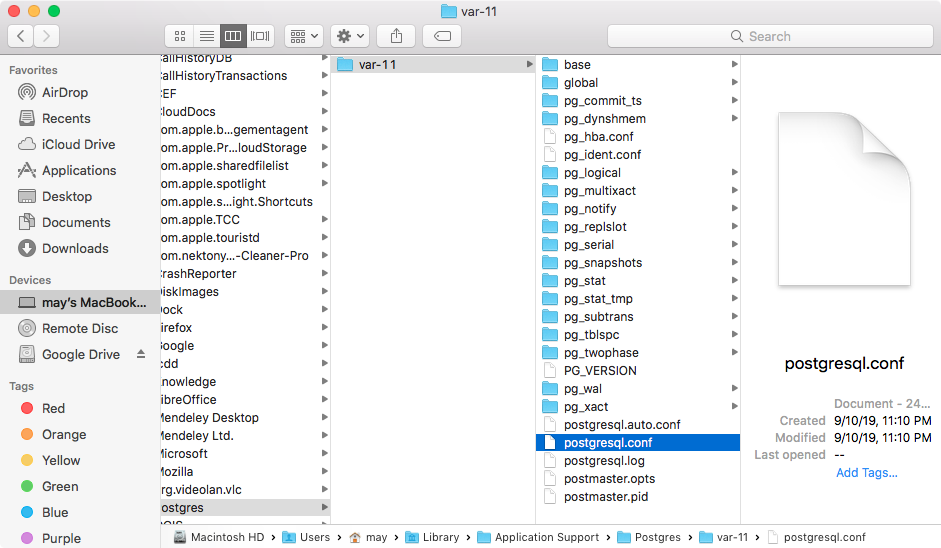
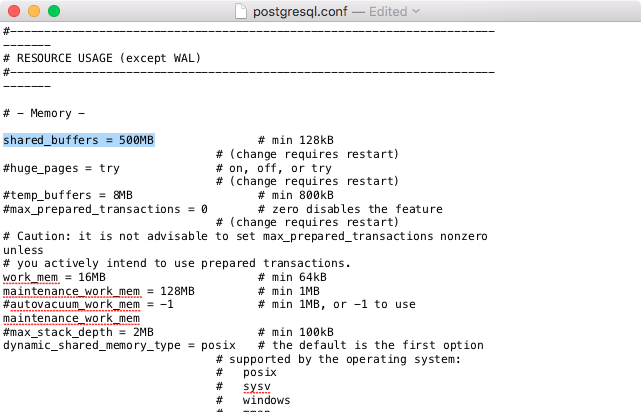
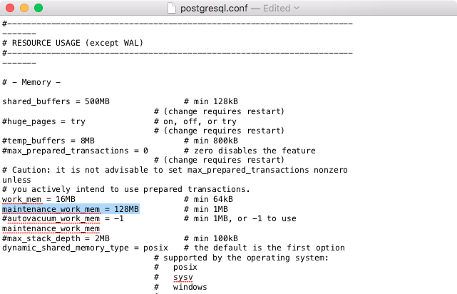
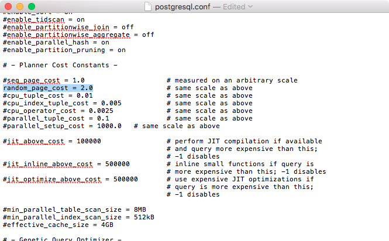

.. _tuning:

Tuning PostgreSQL for Spatial
=============================

PostgreSQL is a very versatile database system, capable of running efficiently in very low-resource environments and environments shared with a variety of other applications.  In order to ensure it will run properly for many different environments, the default configuration is very conservative and not terribly appropriate for a high-performance production database.  Add the fact that geospatial databases have different usage patterns, and the data tend to consist of fewer, much larger records than non-geospatial databases, and you can see that the default configuration will not be totally appropriate for our purposes.  

All of these configuration parameters can be edited in the :file:`postgresql.conf` configuration file. If using Mac with the postgres app installation, this is :file:`/Users/may/Library/Application Support/Postgres/var-11/postgresql.conf` This is a regular text file and can be edited using TextEdit or any other text editor.  The changes will not take effect until the server is restarted.

This section describes some of the configuration parameters that should be adjusted for a production-ready geospatial database.  For each section, find the appropriate item in the file, remove the comment symbol **#** and change the *Value* to the recommended value as described, then after editing all values **Save** the file.

.. note:: These values are recommendations only; each environment will differ and testing is required to determine the optimal configuration.  But this section should get you off to a good start.

shared_buffers
--------------

Sets the amount of memory the database server uses for shared memory buffers.  These are shared amongst the back-end processes, as the name suggests.  The default values are typically woefully inadequate for production databases.

  *Default value*: typically 128MB

  *Recommended value*: 75% of database memory (500MB)

work_mem
--------

Defines the amount of memory that internal sorting operations and hash tables can consume before the database switches to on-disk files.  This value defines the available memory for each operation; complex queries may have several sort or hash operations running in parallel, and each connected session may be executing a query.

As such you must consider how many connections and the complexity of expected queries before increasing this value.  The benefit to increasing is that the processing of more of these operations, including ORDER BY, and DISTINCT clauses, merge and hash joins, hash-based aggregation and hash-based processing of subqueries, can be accomplished without incurring disk writes.

  *Default value*: 4MB

  *Recommended value*: 16MB

.. image:: ./tuning/work_mem.png

maintenance_work_mem
--------------------

Defines the amount of memory used for maintenance operations, including vacuuming, index and foreign key creation.  As these operations are not terribly common, the default value may be acceptable.  This parameter can alternately be increased for a single session before the execution of a number of :command:`CREATE INDEX` or :command:`VACUUM` calls as shown below.

  .. code-block:: sql

    SET maintenance_work_mem TO '128MB';
    VACUUM ANALYZE;
    SET maintenance_work_mem TO '16MB';

  *Default value*: 64MB

  *Recommended value*: 128MB

random_page_cost
----------------

This is a unit-less value that represents the cost of a random page access from disk.  This value is relative to a number of other cost parameters including sequential page access, and CPU operation costs.  While there is no magic bullet for this value, the default is generally conservative.  This value can be set on a per-session basis using the ``SET random_page_cost TO 2.0`` command.

  *Default value*: 4.0

  *Recommended value*: 2.0

seq_page_cost
-------------

This is the parameter that controls the cost of a sequential page access.  This value does not generally require adjustment but the difference between this value and ``random_page_cost`` greatly affects the choices made by the query planner.  This value can also be set on a per-session basis.

  *Default value*: 1.0

  *Recommended value*: 1.0

.. image:: ./tuning/seq_page_cost.png

Reload configuration
--------------------

After these changes are made, save changes and reload the configuration. The easiest way to do this is to restart the PostgreSQL service.

* In pgAdmin, right-click the server **PostGIS (localhost:5432)** and select *Reload Configuration*.
